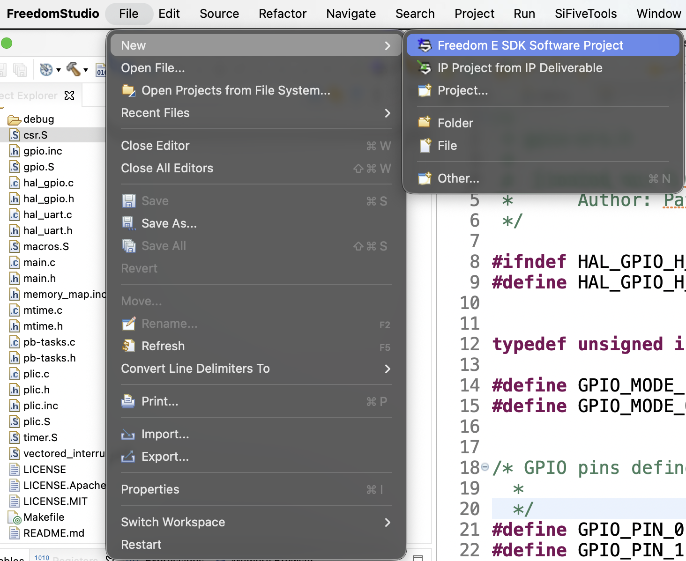
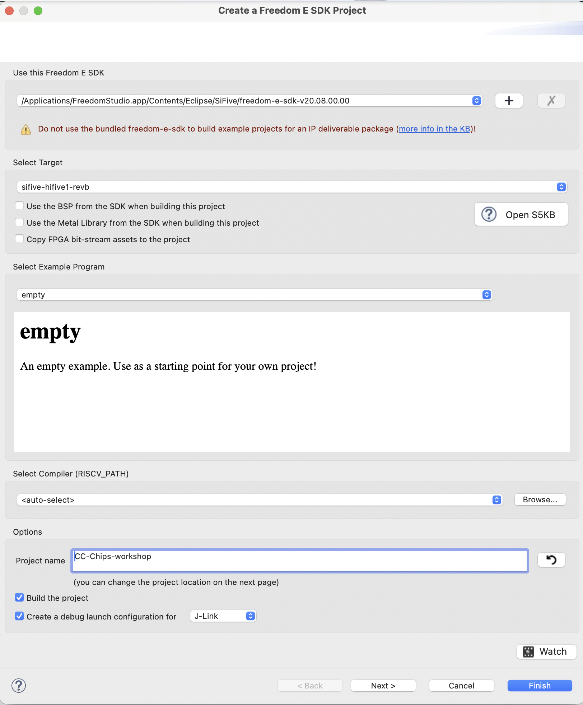
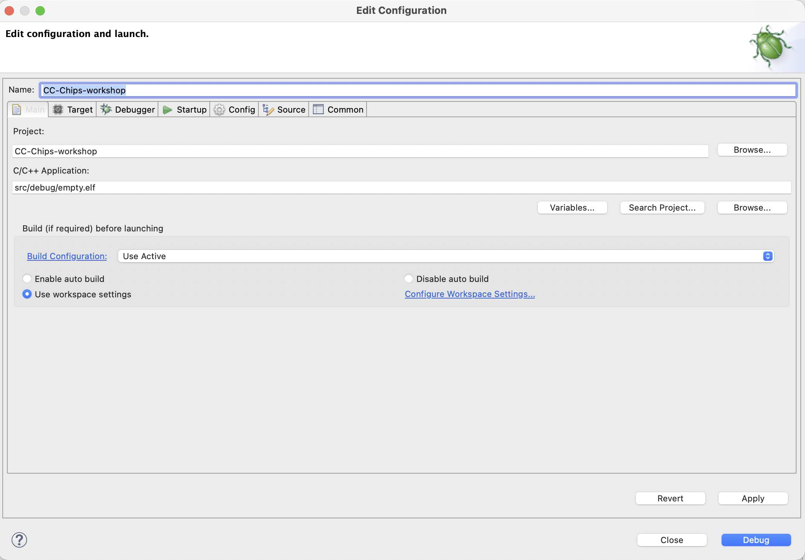

# Setting up Freedom Studio

> **In this part you will**
> - meet the workshop board and the IDE we use to program it,
> - create an **empty** Freedom E SDK project for the **HiFive1 Rev B**,
> - add the book's source files and **build** them,
> - **flash and debug** the board over its on-board J-Link, and
> - open a **serial console** to watch the UART output.

The board for this workshop is the **SiFive HiFive1 Rev B**, which carries the
**FE310-G002**. Its on-board USB debugger is a SEGGER **J-Link-OB**, so a single
USB cable both powers the board and lets the IDE program and debug it — no
external probe is needed.

We write, build, and debug everything in **Freedom Studio**, SiFive's
Eclipse-based IDE. It bundles everything required: the RISC-V GCC toolchain, the
debugger, and the **Freedom E SDK** with its board-support packages and example
projects. We use it purely as editor, compiler, and debugger — all of the
*interesting* code (the vector table, the handlers, the HAL) is the book's own.

## What runs before `main`

It is worth understanding this up front, because it explains the project layout.
When you start from the SDK's **empty** example, the SDK supplies the
board-support package (BSP): the **linker script** and the **startup code** that
runs out of reset. That startup — part of **Freedom Metal**, SiFive's HAL — sets
the stack pointer, clears `.bss`, copies `.data` into RAM, installs a minimal
default trap vector, and *then* calls your `main`.

So Freedom Metal owns **boot and C-runtime setup**; your code owns **everything
from `main` onward**. In particular, the first time `main` runs
`register_handler(_vector_table, INT_MODE_VECTORED)` (see
[Vector table and handlers](./interrupts/vector-table.md)) it overwrites `mtvec`
and takes the trap vector away from Metal. From that moment every trap and
interrupt flows through the book's own handlers.

One rule follows from this: **do not mix HALs.** The book ships its own
`hal_gpio` / `hal_uart` and its own CLINT/PLIC code; do not *also* drive those
peripherals through Metal's drivers, or the two will fight over the same
hardware. Let Metal boot you, then ignore it.

## 1. Create an empty project

From the menu choose **File → New → Freedom E SDK Software Project**.

Starting a new Freedom E SDK software project. The Project Explorer on the left shows a project already populated with the workshop sources.

The project wizard opens. Set it up like this:

- **Use this Freedom E SDK** — leave the bundled SDK selected (here
  `freedom-e-sdk-v20.08.00.00`). The red note about *IP deliverable packages*
  does not apply to us; ignore it.
- **Select Target** — choose **`sifive-hifive1-revb`**. This pins the build to
  the FE310-G002 and the correct linker script.
- Leave **Use the BSP from the SDK** and **Use the Metal Library from the SDK**
  *unchecked*. Unchecked means Freedom Studio **copies** the BSP and the Metal
  sources into the project, so the project is self-contained — this is why you
  will later see `bsp/` and `freedom-metal/src/` folders inside it.
- **Select Example Program** — choose **`empty`** ("Use as a starting point for
  your own project").
- **Select Compiler (RISCV_PATH)** — leave **`<auto-select>`**.
- **Project name** — anything; the figure uses `CC-Chips-workshop`.
- Tick **Build the project** and **Create a debug launch configuration for** →
  **J-Link**.

The project wizard: target <code>sifive-hifive1-revb</code>, the <code>empty</code> example, and a J-Link debug configuration.

Click **Finish**. Freedom Studio creates the project, copies in the BSP and
Metal, and builds the (still empty) program once.

## 2. Add the book's source files

The empty example leaves you with a stub `main.c`. Replace it with the workshop
sources — the contents of the companion
[`code/`](https://github.com/bulicp/riscv-fe310-book/tree/main/code) tree:
`csr.S`, `gpio.S` / `gpio.inc`, `hal_gpio.*`, `hal_uart.*`, `macros.S`, `main.*`,
`mtime.*`, `pb-tasks.*`, `plic.*` / `plic.inc`, `timer.S`,
`vectored_interrupts.S`, and the memory-map include. Add them to the project's
source folder so the SDK's Makefile compiles them. The Project Explorer in the
figure above shows what the project looks like once it is populated.

Because we started from the example named *empty*, the build still produces an
ELF called **`empty.elf`** (under `src/debug/`). That is only a filename — it now
contains *your* code. You can rename the program by editing the `PROGRAM`
variable in the Makefile, but it is not necessary.

## 3. Build

Build with the hammer toolbar button, or **Project → Build Project** (⌘B on
macOS, Ctrl+B elsewhere). The SDK Makefile compiles every source file and links
them against the BSP, producing `src/debug/empty.elf`. Fix any errors before
continuing — a clean build is required before debugging.

## 4. Flash and debug

The wizard already created a **J-Link** debug launch configuration. Open
**Run → Debug Configurations…** and select it under *SiFive GDB SEGGER J-Link
Debugging*. Its **Main** tab should look like this:

The debug launch configuration. <strong>C/C++ Application</strong> points at <code>src/debug/empty.elf</code> and <strong>Build Configuration</strong> is <em>Use Active</em>.

Confirm that **C/C++ Application** is `src/debug/empty.elf` and **Project** is
your project, then press **Debug**. Freedom Studio will:

1. build if needed;
2. connect to the J-Link-OB over USB;
3. **flash** the ELF into the board's SPI flash — the program lives at
   **`0x20010000`** and the boot code runs from there. (This is also why the
   book's vector-table BASE sits at `0x20011500`: just above the entry, inside
   the same flash region.)
4. halt at the entry, so you can set breakpoints, single-step, and inspect
   registers and memory.

Press **Resume** to let it run. Re-running **Debug** after a code change
re-flashes the board automatically.

> **If a flash or connect step fails**, press the board's **RESET** button and
> try again. A program that stops the core's clock or puts it to sleep with no
> wake-up can block the programmer; reset recovers the board.

## 5. See the UART output

The J-Link-OB also presents a **virtual serial port** over the same USB cable.
Open it in any serial terminal at **115200 baud, 8 data bits, no parity, 1 stop
bit (8N1)** — the exact frame format the
[UART chapter](./mmio/fe310-uart.md) configures. Once the UART driver runs,
whatever `HAL_UART_Transmit` sends — for instance the `"Hello, FE310!\r\n"` from
[Programming the UART in C](./mmio/uart-in-c.md) — appears in the terminal. This
is the simplest end-to-end check that your build really is running on the chip.

With the project building, flashing, and printing, you are ready for the rest of
the book.
