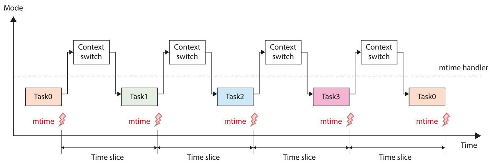
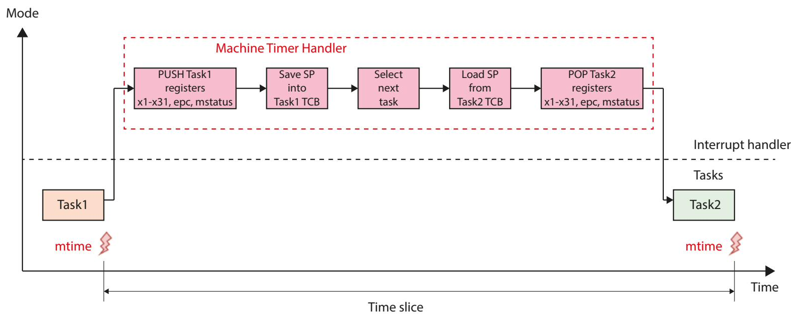
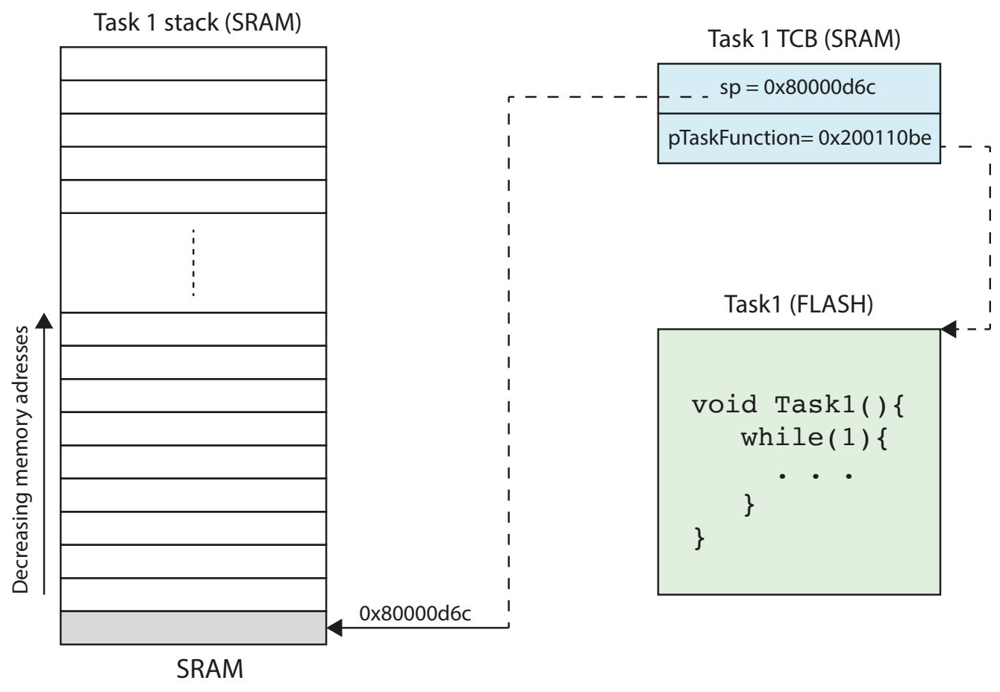
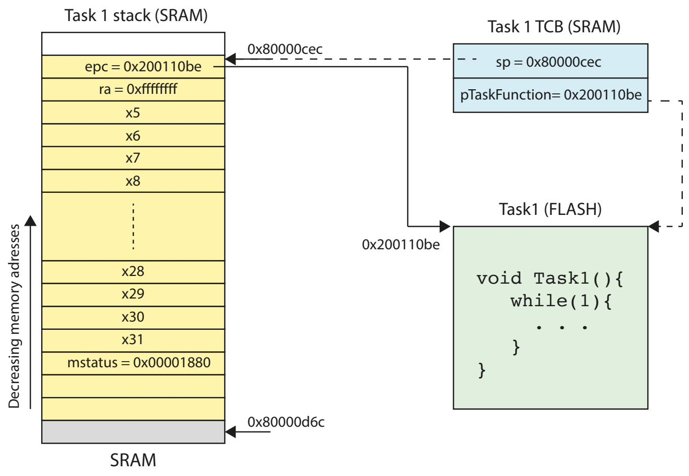
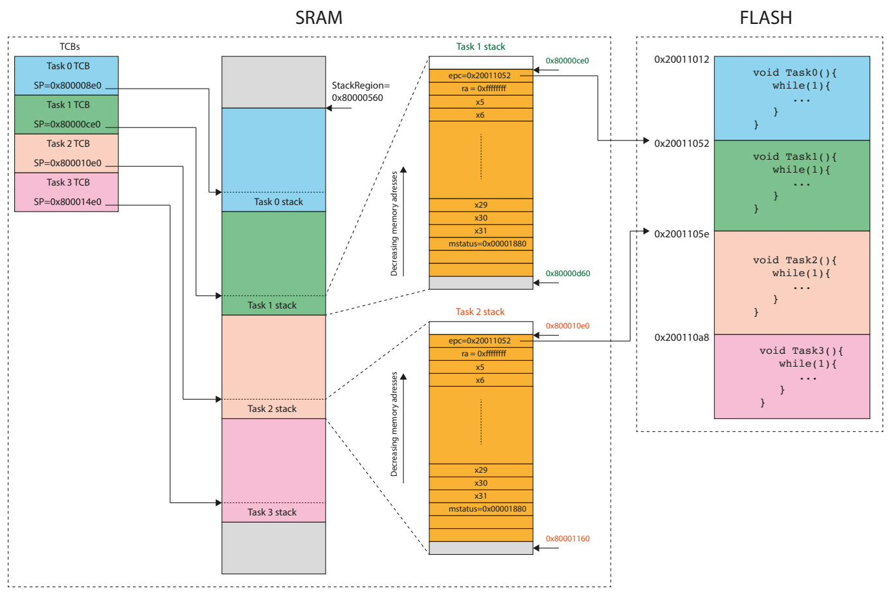
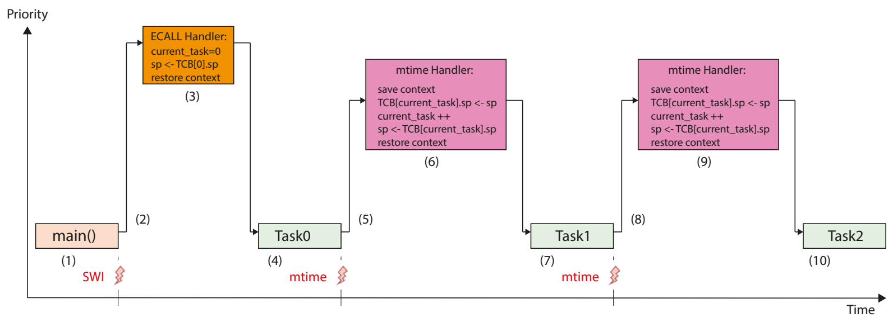

# Case study: a round-robin scheduler

We can now combine everything — the timer interrupt, the vector table, and
context save/restore — into a small **preemptive round-robin scheduler** for the
FE310. Each task gets a fixed time slice; when the machine timer fires, the
scheduler saves the running task, picks the next one, and resumes it.

The full implementation is
[`code/scheduler/pb-tasks.c`](https://github.com/bulicp/riscv-fe310-book/blob/main/code/scheduler/pb-tasks.c)/
[`.h`](https://github.com/bulicp/riscv-fe310-book/blob/main/code/scheduler/pb-tasks.h),
the assembly context switch is in
[`vectored_interrupts.S`](https://github.com/bulicp/riscv-fe310-book/blob/main/code/interrupts/vectored_interrupts.S)
with macros in
[`macros.S`](https://github.com/bulicp/riscv-fe310-book/blob/main/code/interrupts/macros.S),
and the entry point is
[`main.c`](https://github.com/bulicp/riscv-fe310-book/blob/main/code/scheduler/main.c).

## Background


<p class="caption">A simple round-robin scheduler on the RISC-V-based FE310.</p>

Each task runs for a fixed **quantum**. When the quantum expires, the **machine
timer interrupt** switches to the next task in the queue. The scheduler relies on
two things: the timer interrupt for preemption, and a per-task **stack** for
holding a suspended task's state.

A key difference from ARM Cortex-M: that core has *two* stack pointers (one for
tasks, one for handlers), which keeps kernel and task stacks apart. RISC-V's E31
has only **one** stack pointer, and both tasks and kernel run in **Machine mode**.
So the handler must manage the single stack pointer carefully during a switch.


<p class="caption">What happens during a context switch: the handler pushes the interrupted task's registers, saves its SP in the TCB, selects the next task, loads its SP, and pops its registers.</p>

When a timer interrupt arrives, the handler must save the *complete* context of
the interrupted task, because — as we saw — the hardware only saves `mepc` and
`mstatus`. That means pushing `x1` (ra), `x5`–`x31`, plus the saved `mepc` and
`mstatus` onto the task's stack, recording the task's SP, then doing the reverse
for the next task before `mret` resumes it.

Three routines build and run the scheduler — **create**, **initialise**, and
**switch** — backed by a per-task stack region and a **Task Control Block (TCB)**:

```c
#define NTASKS           4
#define TASK_STACK_SIZE  256
#define WORD_SIZE        4
#define CONTEXT_SIZE     (32 * WORD_SIZE)

typedef struct {
    unsigned int *sp;            // last-seen stack pointer of the task
    void (*pTaskFunction)();     // address of the task's function
} TCB_Type;
```

## Task creation

`TaskCreate` records, in the task's TCB, where its stack starts and which
function it runs.


<p class="caption">Memory layout after <code>TaskCreate()</code>.</p>

```c
void TaskCreate(TCB_Type *pTCB, unsigned int *pTaskStackBase,
                void (*TaskFunction)()) {
    pTCB->sp            = (unsigned int *) pTaskStackBase;
    pTCB->pTaskFunction = TaskFunction;
}
```

## Task initialisation

`TaskInit` prepares a task's **stack frame** so that the very first context
switch can "restore" it as though it had been running before. The frame mirrors
the layout the context-switch code expects:

```c
typedef struct {
    unsigned int mepc;      // (sp + 0)
    unsigned int x1;        // (sp + 1)  ra
    unsigned int x5;        // (sp + 2)  t0
    /* ... x6 ... x31 ... */
    unsigned int mstatus;   // (sp + 29)
    unsigned int unused1;   // (sp + 30)
    unsigned int unused2;   // (sp + 31)
} Context_TypeDef;
```


<p class="caption">Memory layout after <code>TaskInit()</code>.</p>

```c
void TaskInit(TCB_Type *pTCB) {
    Context_TypeDef *pStackFrame;

    // Reserve the frame at the top of the task's stack:
    pStackFrame = (Context_TypeDef *)((void *)pTCB->sp - sizeof(Context_TypeDef));

    // Populate the initial frame:
    pStackFrame->mepc    = (unsigned int)(pTCB->pTaskFunction); // start here
    pStackFrame->x1      = 0xFFFFFFFF;                          // ra: task never returns
    pStackFrame->mstatus = (0x03 << 11) | (0x01 << 7);         // 0x1880: MPP=11 (M), MPIE=1

    // Save the new top-of-frame as the task's SP:
    pTCB->sp = (unsigned int *) pStackFrame;
}
```

The three values that matter:

- **`mstatus` = 0x00001880** — sets the previous privilege **MPP = 11** (Machine)
  and previous interrupt-enable **MPIE = 1**, so when the task is first resumed
  with `mret`, it lands in Machine mode with interrupts on.
- **`mepc`** = the task's entry address — where execution begins.
- **`x1` (ra) = 0xFFFFFFFF** — the tasks never return, so the return address is a
  sentinel.

## Scheduler initialisation

`InitScheduler` creates and initialises every task, after which the system is
ready for the first switch:

```c
void InitScheduler(unsigned int *pStackRegion, TCB_Type pTCB[],
                   void (*TaskFunctions[])()) {
    unsigned int *pTaskStackBase;

    // 1. create all tasks
    for (int i = 0; i < NTASKS; i++) {
        pTaskStackBase = pStackRegion + (i + 1) * TASK_STACK_SIZE;
        TaskCreate(&pTCB[i], pTaskStackBase, TaskFunctions[i]);
    }

    // 2. initialise all tasks
    for (int i = 0; i < NTASKS; i++)
        TaskInit(&pTCB[i]);
}
```


<p class="caption">Memory layout and per-task stacks after the scheduler is initialised with four tasks.</p>

The next task is chosen in plain round-robin order:

```c
int SelectNewTask(int current_task) {
    int new_task = current_task + 1;
    if (new_task == NTASKS) new_task = 0;
    return new_task;
}
```

## The machine timer interrupt handler

This is the heart of the switch, and **it must be assembly**. Because RISC-V has
a single stack pointer and the C compiler would emit its own prologue (corrupting
that pointer), only hand-written assembly can manage the stack precisely enough.
The handler saves the old context, advances the tick, switches the stack pointer
to the next task, and restores its context:

```asm
.global _mtim_interrupt_handler
_mtim_interrupt_handler:
    __macro_SAVE_CONTEXT            # push x1, x5-x31, mepc, mstatus

    csrr t0, mcause                 # decode cause
    bgez t0, 2f                     # not an interrupt -> skip

    __macro_INCREMENT_TICK          # schedule the next timer interrupt
    __macro_SWITCH_CONTEXT          # save this SP, pick next task, load its SP
2:
    __macro_RESTORE_CONTEXT         # pop the (new) task's context
    mret
```

The four macros (from `macros.S`) do the heavy lifting. **Save** and **restore**
move the full register set to and from the running task's stack:

```asm
.macro __macro_SAVE_CONTEXT
    addi sp, sp, -CONTEXT_SIZE
    sw x1,  1*WORD_SIZE(sp)
    sw x5,  2*WORD_SIZE(sp)
    /* ... x6 ... x31 ... */
    csrr t0, mepc
    sw t0,  0*WORD_SIZE(sp)
    csrr t0, mstatus
    sw t0,  29*WORD_SIZE(sp)
.endm

.macro __macro_RESTORE_CONTEXT
    lw t0,  0*WORD_SIZE(sp)
    csrw mepc, t0
    lw t0,  29*WORD_SIZE(sp)
    csrw mstatus, t0
    lw x1,  1*WORD_SIZE(sp)
    /* ... x5 ... x31 ... */
    addi sp, sp, CONTEXT_SIZE
.endm
```

**Increment-tick** programs the next interrupt one `TIME_SLICE` ahead, as a
64-bit add with carry on `mtime`/`mtimecmp`:

```asm
.macro __macro_INCREMENT_TICK
    la t0, CLINT_MTIME
    lw t1, 0(t0)            # mtime (lo)
    lw t2, 4(t0)            # mtime (hi)
    li t3, TIME_SLICE
    add  t3, t1, t3         # lo + slice
    sltu t1, t3, t1         # carry
    add  t2, t2, t1         # hi + carry
    la t0, CLINT_MTIME_CMP
    sw t3, 0(t0)            # mtimecmp (lo)
    sw t2, 4(t0)            # mtimecmp (hi)
.endm
```

**Switch-context** is where the single stack pointer is juggled: it stores the
current `sp` into `TCB[current_task]`, advances `current_task` round-robin, then
loads `sp` from the new task's TCB:

```asm
.macro __macro_SWITCH_CONTEXT
    la  t0, current_task
    lw  t1, 0(t0)           # current_task
    sll t4, t1, 3           # * 8 (TCB stride)
    la  t5, TCB
    add t5, t5, t4
    sw  sp, 0(t5)           # TCB[current].sp = sp

    addi t1, t1, 1          # next task, wrap at NTASKS
    li  t2, NTASKS
    bne t1, t2, 1f
    li  t1, 0
1:  sw  t1, 0(t0)

    sll t4, t1, 3
    la  t5, TCB
    add t5, t5, t4
    lw  sp, 0(t5)           # sp = TCB[next].sp
.endm
```

These macros depend on a few assemble-time constants defined at the top of
`vectored_interrupts.S`:

```asm
.equ NTASKS,       4
.equ TIME_SLICE,   33          # ~1 ms at 32.768 kHz
.equ WORD_SIZE,    4
.equ CONTEXT_SIZE, (32 * WORD_SIZE)
```

## Starting the scheduler with `ecall`

Rather than *calling* the first task from `main`, the scheduler **returns into**
it — using the **environment call** exception. The `ecall` instruction raises a
trap; because exceptions dispatch directly to BASE (slot 0), control lands in the
exception handler.


<p class="caption">Starting the scheduler with the environment-call exception.</p>

The exception handler recognises an M-mode `ecall` (cause `0xB`), points `sp` at
Task 0's stack, arms the first tick, enables the timer interrupt, and restores
Task 0's context. The closing `mret` then "returns" straight into Task 0:

```asm
.global _exception_handler
_exception_handler:
    csrr t0, mcause
    bltz t0, 2f             # interrupt, not an exception -> skip

    li   t1, 0xB            # ecall from M-mode?
    bne  t1, t0, 2f

    la   t1, TCB            # 1. sp <- TCB[0].sp
    lw   sp, 0(t1)

    __macro_INCREMENT_TICK  # 2. schedule first tick

    li   t0, 0x00000080     # 3. enable MTIE
    csrs mie, t0

    __macro_RESTORE_CONTEXT # 4. restore Task 0's context
2:
    mret                    # 5. "return" into Task 0
```

## Tying it together in `main`

```c
GPIO_TypeDef *GPIO = GPIO_BASE_ADDRESS;

int main() {
    GPIO_Init();

    TaskFunctions[0] = Task0;
    TaskFunctions[1] = Task1;
    TaskFunctions[2] = Task2;
    TaskFunctions[3] = Task3;

    InitScheduler(stackRegion, TCB, TaskFunctions);
    current_task = 0;

    // vectored interrupts + global enable
    _register_handler(_vector_table, INT_MODE_VECTORED);
    _enable_global_interrupts();

    // hand control to the scheduler via an environment call:
    __asm__ volatile("ecall");

    while (1) {}
    return 0;
}
```

From the `ecall` onward the four tasks share the CPU: every `TIME_SLICE` the
machine timer fires, `_mtim_interrupt_handler` saves the current task and resumes
the next, round and round. In the sample tasks that means the on-board RGB LED
blinks under three independent "threads" while a fourth idles — a tiny preemptive
multitasking kernel in a few hundred lines of C and assembly.
