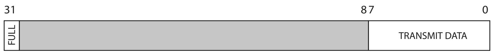
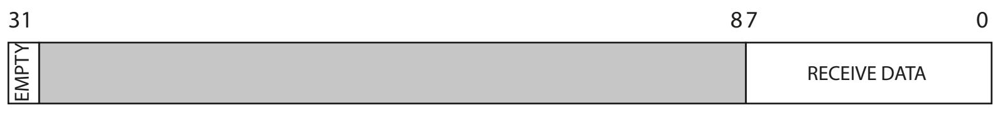
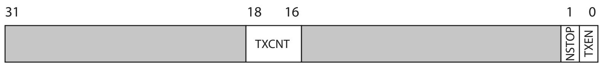
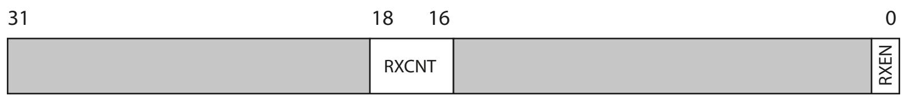

# The UART interface in the SiFive FE310

The UART block in the FE310 offers:

- frame format of **8 data bits, no parity, 1 start bit, and 1 or 2 stop bits**;
- an **8-entry transmit FIFO** and an **8-entry receive FIFO**, each with a
  programmable watermark interrupt.

The SoC has two UARTs. **UART0** is mapped at `0x10013000` and **UART1** at
`0x10023000`. We work with UART0. Its registers are 32 bits wide and must be
accessed with naturally-aligned 32-bit loads and stores.

| Offset | Name     | Description               |
|:------:|:---------|:--------------------------|
| `0x00` | `txdata` | Transmit data register    |
| `0x04` | `rxdata` | Receive data register     |
| `0x08` | `txctrl` | Transmit control register |
| `0x0C` | `rxctrl` | Receive control register  |
| `0x10` | `ie`     | UART interrupt enable     |
| `0x14` | `ip`     | UART interrupt pending    |
| `0x18` | `div`    | Baud-rate divisor         |

Register offsets within the UART memory map.

To transmit and receive without interrupts we only need a few of these.

## `txdata` — transmit data

Writing to `txdata` **enqueues** the byte in the `data` field into the transmit
FIFO, *if* the FIFO can accept it. Reading `txdata` returns the current value of
the **FULL** flag (bit 31) and zero in the data field; while FULL is set, writes
to `data` are ignored.

The <code>txdata</code> register.

## `rxdata` — receive data

Reading `rxdata` **dequeues** a byte from the receive FIFO and returns it in the
`data` field. The **EMPTY** flag (bit 31) tells you whether the FIFO was empty;
when EMPTY is set, the data field is not valid. Writes to `rxdata` are ignored.

The <code>rxdata</code> register.

## `txctrl` — transmit control

The read-write `txctrl` register controls the transmitter. The **TXEN** bit
enables it; when cleared, transmission is suppressed and the TX pin is driven
high. The **NSTOP** field selects the number of stop bits: `0` for one, `1` for
two.

The <code>txctrl</code> register.

## `rxctrl` — receive control

The read-write `rxctrl` register controls the receiver. The **RXEN** bit enables
it; when cleared, the state of the RX pin is ignored.

The <code>rxctrl</code> register.

## `div` — baud-rate divisor

The read-write `div` register holds the divisor the baud-rate generator uses to
divide the CPU clock down to the desired baud rate. For **115200 bps** on the
FE310, `div` is **139**. Consult the SiFive FE310 manual for the exact formula
for other rates.
