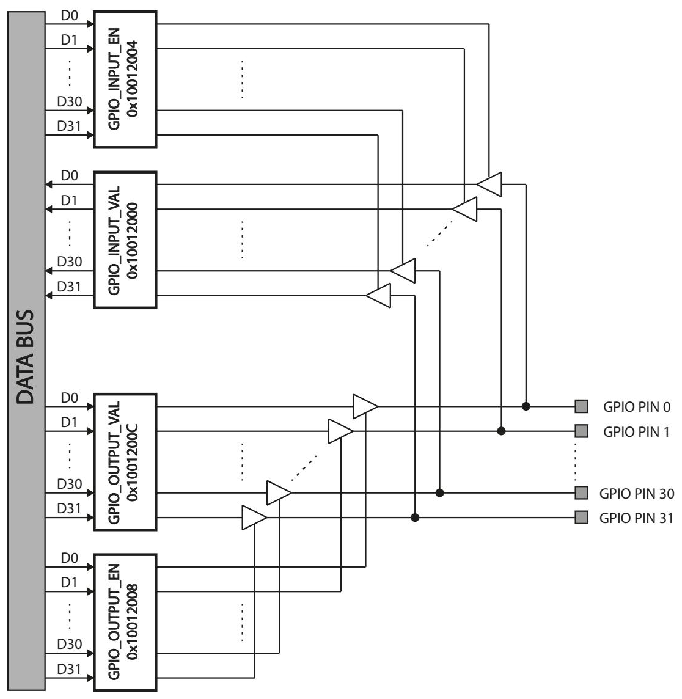

# Case study: the GPIO interface on the FE310

> **In this part you will**
> - learn what a *General-Purpose Input/Output* (GPIO) interface is and how it is
>   just another block of memory-mapped registers,
> - meet the four core GPIO registers of the SiFive FE310,
> - drive pins from **assembly**, manipulating one bit at a time, and
> - wrap the same operations in a small **C** hardware-abstraction layer.

**GPIO** stands for *General-Purpose Input/Output*: an interface whose pins do
simple digital input or output. The pins are "general purpose" because they are
not tied to a fixed function — we program each one for whatever a project needs.

Configured as **input**, a pin reports whether the voltage on it is **high**
(logic 1, typically 3.3 V) or **low** (logic 0, 0 V). Configured as **output**, a
pin *drives* a high or low level. That covers a huge range of jobs: reading
sensors, lighting LEDs, switching relays and motors, or talking to other digital
parts.

Like every peripheral in this book, a GPIO interface is **a set of memory-mapped
registers**. They set each pin's direction, read or write its value, and (on the
full device) handle events such as edges on a pin.

## The GPIO interface in the FE310

The FE310 has **32 GPIO pins**. The GPIO block is mapped at **`0x10012000`** and
has 19 registers in total; every register is 32 bits wide and **each bit
corresponds to one pin**. To keep things clear we focus on just four:

| Offset | Name | Description |
|:------:|:-----|:------------|
| `0x00` | `GPIO_INPUT_VAL`  | Pin input value |
| `0x04` | `GPIO_INPUT_EN`   | Pin input enable |
| `0x08` | `GPIO_OUTPUT_EN`  | Pin output enable |
| `0x0C` | `GPIO_OUTPUT_VAL` | Pin output value |

The four core GPIO registers (all reset to 0).

A simplified structure of the FE310 GPIO interface. Several registers are omitted for clarity.

What each register does, bit by bit:

- **`GPIO_INPUT_VAL`** — the current input level of every pin: `1` = high, `0` =
  low.
- **`GPIO_OUTPUT_VAL`** — the values to drive on pins configured as outputs.
- **`GPIO_OUTPUT_EN`** — output enable. When a pin's bit is `1`, the matching bit
  of `GPIO_OUTPUT_VAL` is connected to the pin through its tri-state buffer, so
  that value appears on the pin.
- **`GPIO_INPUT_EN`** — input enable. When a pin's bit is `1`, the pin's level is
  captured into the matching bit of `GPIO_INPUT_VAL`.

That is the whole mental model: pick a direction with the *enable* register, then
read `INPUT_VAL` or write `OUTPUT_VAL`. The next two sections do exactly this,
first in assembly and then in C. The companion code is
[`gpio.S`](https://github.com/bulicp/riscv-fe310-book/blob/main/code/drivers/gpio.S)/[`gpio.inc`](https://github.com/bulicp/riscv-fe310-book/blob/main/code/drivers/gpio.inc)
and
[`hal_gpio.c`](https://github.com/bulicp/riscv-fe310-book/blob/main/code/drivers/hal_gpio.c)/[`.h`](https://github.com/bulicp/riscv-fe310-book/blob/main/code/drivers/hal_gpio.h).
