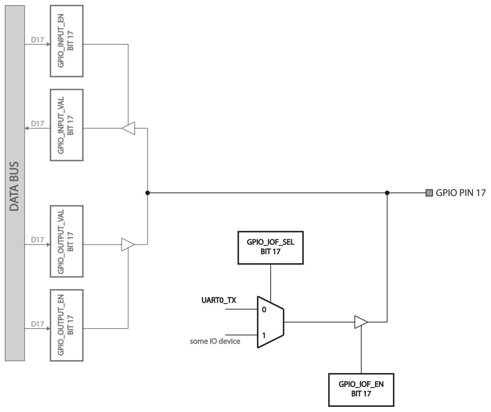

# UART pins and IO functions

The UART driver in the previous section started by touching two GPIO registers,
`GPIO_IOF_SEL` and `GPIO_IOF_EN`. This section explains why.

Many FE310 GPIO pins are **multi-purpose**. Besides plain input/output, each pin
can be claimed by one of up to two **IO functions (IOF)** — alternate functions
wired to on-chip peripherals such as the UART, SPI, or I²C. Two registers control
this multiplexer:

- **`GPIO_IOF_EN`** — enables the IO function on a pin. Setting bit *n* hands pin
  *n* over to a peripheral instead of the plain GPIO logic.
- **`GPIO_IOF_SEL`** — when IOF is enabled, selects *which* of the two functions
  the pin performs.

For pin 17, for example, clearing bit 17 in `GPIO_IOF_SEL` selects the **UART0
transmitter (UART0_TX)**, and setting bit 17 in `GPIO_IOF_EN` enables it. So
UART0 TX appears on **GPIO pin 17** and UART0 RX on **GPIO pin 16**.


<p class="caption">The IO-function registers for GPIO pin 17. The familiar input/output/enable registers are shown in light grey; <code>GPIO_IOF_SEL</code> and <code>GPIO_IOF_EN</code> add the alternate-function multiplexer.</p>

## The full GPIO register block

To reach those two registers from C we use the complete GPIO structure introduced
in [Programming GPIO in C](./gpio-c.md) — the same `GPIO_TypeDef` and
`GPIO_BASE_ADDRESS`. The two members that matter here are near the end of the
block:

```c
typedef struct {
    volatile uint32t GPIO_INPUT_VAL;   // 0x00
    /* ... input/output enable, value, pull-ups, edge/level interrupts ... */
    volatile uint32t GPIO_IOF_EN;      // alternate-function enable
    volatile uint32t GPIO_IOF_SEL;     // alternate-function select
    volatile uint32t GPIO_OUT_XOR;
} GPIO_TypeDef;

#define GPIO_BASE_ADDRESS  (GPIO_TypeDef *)0x10012000
```

## Setting up UART0 on pins 16/17

Routing UART0 onto its pins is then two masked register writes. The driver uses
these constants from `hal_uart.h`:

```c
#define UART0_PINS_SEL  0xfffcffff   // clear bits 16 and 17 -> select UART function
#define UART0_PINS_EN   0x00030000   // set   bits 16 and 17 -> enable IOF
```

and applies them exactly as we saw inside `HAL_UART_Init`:

```c
GPIO->GPIO_IOF_SEL &= UART0_PINS_SEL;   // pins 16,17 -> function 0 (UART0)
GPIO->GPIO_IOF_EN  |= UART0_PINS_EN;    // enable IOF on pins 16,17
```

`GPIO_IOF_SEL &= 0xfffcffff` clears bits 16 and 17 (selecting the UART function),
while `GPIO_IOF_EN |= 0x00030000` sets the same two bits (enabling the function).
After this, anything `HAL_UART_Transmit` pushes into `txdata` leaves the chip on
GPIO pin 17.

> The same `GPIO_TypeDef` and base-address pointer drive the plain GPIO HAL
> (`HAL_GPIO_Init`, `HAL_GPIO_WritePin`, `HAL_GPIO_TogglePin`,
> `HAL_GPIO_ReadPin`) used elsewhere in the companion code to blink the on-board
> RGB LED on pins 19/21/22.
