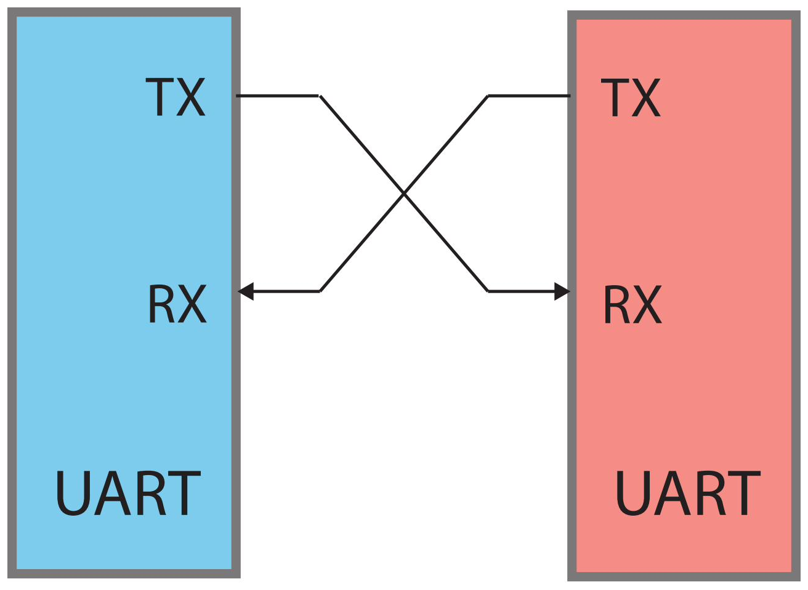
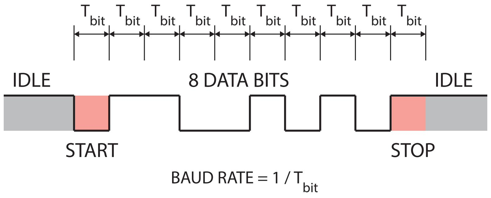

# The UART and serial communication

Before programming the FE310's UART, it helps to recall what the interface does
and how the protocol works.

When two devices exchange data, they can do it in two ways. They can transmit all
bits of a word **in parallel**, using one wire per bit (eight wires for a byte),
or they can send the bits **serially**, one after another, as a stream on a single
wire. A UART takes a parallel data word — usually a byte — and shifts it out one
bit at a time onto a single line.

For serial transmission the **sender** and the **receiver** must agree on the
*timing*: how long each bit lasts. In **synchronous** transmission they share a
clock generated by the sender. But if both ends agree in advance on the bit
duration and on how to mark the start and end of a word, the dedicated clock line
can be dropped. That is **asynchronous** transmission, and it is what the "A" in
UART stands for.

Two UARTs communicate directly with each other.

A UART transmits a word over two I/O lines: one is the transmitter (**TX**) and
one is the receiver (**RX**). Because there is no shared clock, both ends must be
configured for the *same* bit timing. Communication can be **simplex** (one
direction only) or **full-duplex** (both ends transmit at once).

## The UART frame

Data is sent in **frames**. The line idles **high**. Because the link is
asynchronous, the transmitter must announce that data is coming: it does so with
the **start bit**, a transition from the idle high level to low. The start bit is
immediately followed by the data bits — 5 to 9 of them, but most commonly 8 — with
the **least-significant bit first**. An optional **parity bit** for error checking
may follow; it is often omitted.

UART frame format.

After the data bits comes the **stop bit**: the line returns to (or stays at) the
high idle level for at least one bit time. A second stop bit can be configured to
give the receiver more time to get ready, but that is uncommon.

## Baud rate

The time taken to send a single bit fixes the **baud rate**, expressed in bits
per second (bps). Inverting the baud rate gives the bit period — how long the
transmitter holds the line, or how often the receiver samples it. Any reasonable
value works as long as *both* ends agree; the standard rates are 1200, 2400, 4800,
19200, 38400, 57600, and 115200 bps.
